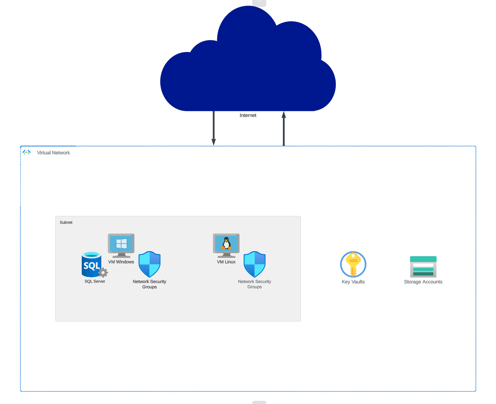
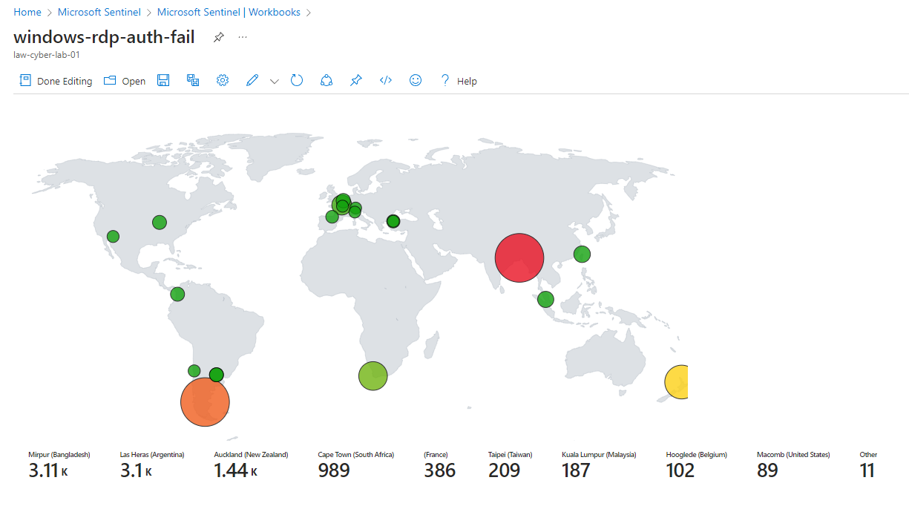
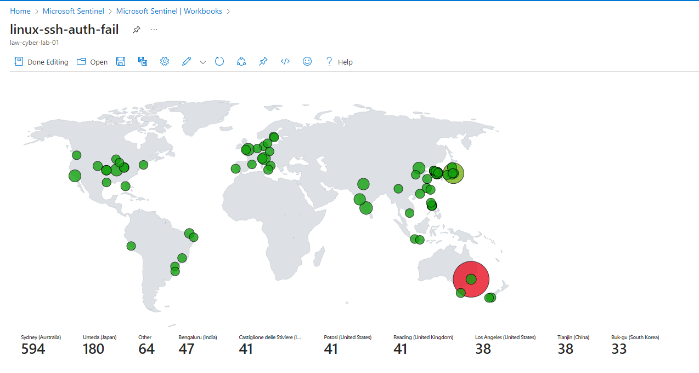
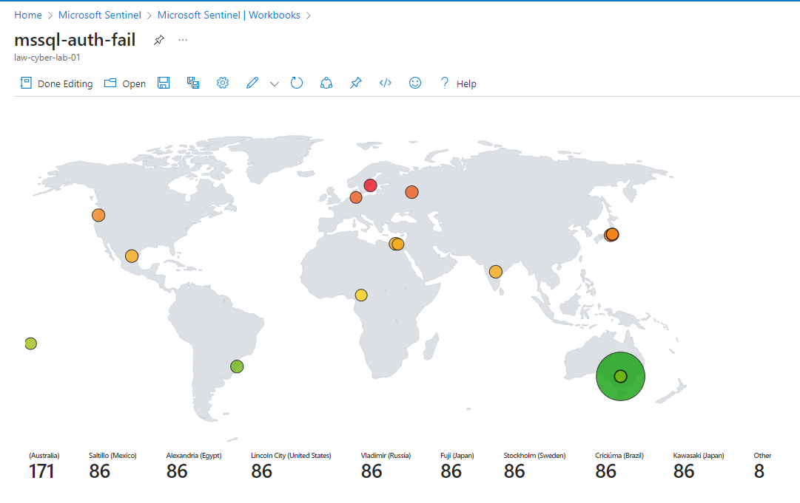
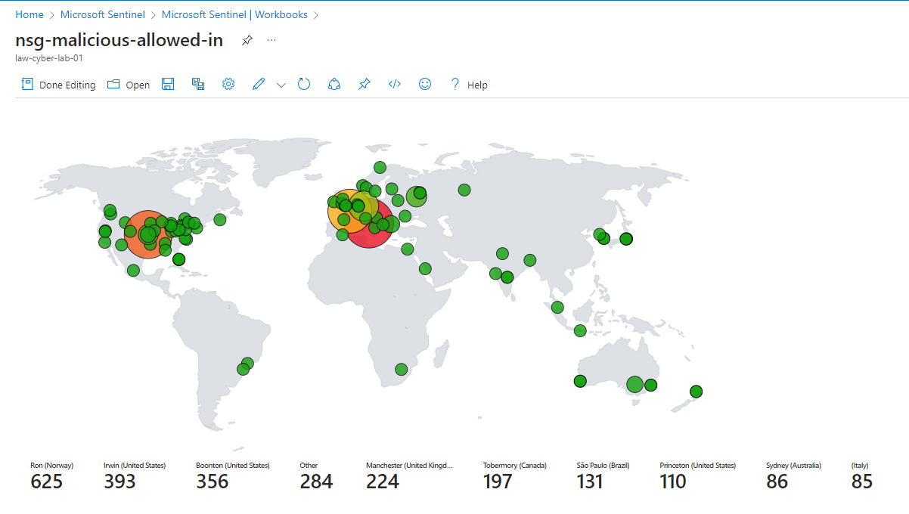
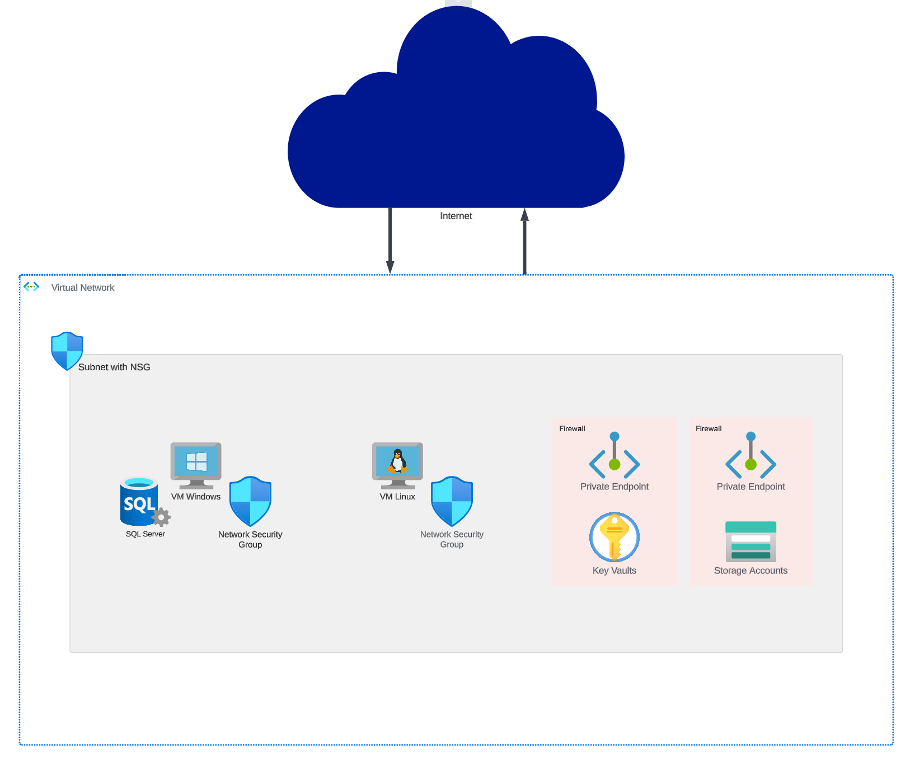

# Implementing a SOC and Honeynet in Azure

## Introduction

The purpose of this lab was to deploy a honeynet using vulnerable VMs, log the security events occuring on those VMs, implement a SOC using Micorosoft Sentinel, and harden those VMs against attack. The honeynet mainly consists of a Windows 10 VM, a Linux VM. Logs are ingested from various resources in a Log Analytics workspace which is then used by Microsoft Sentinel to build attack maps, trigger alerts, and create incidents. The insecure environment is run for 24 hours during which security metrics are measured, security controls are then implemented to harden the environment using recommendations based on NIST 800-53, and metrics are measured for another 24 hours using the hardened environment.

### Metrics Captured

- Security Event (Windows Event Logs)
- Syslog (Linux Event Logs)
- SecurityAlert (Log Analytics Alerts Triggered)
- SecurityIncident (Incidents created by Sentinel)
- AzureNetworkAnalytics_CL (Malicious Flows allowed into the honeynet)

### Honeynet Architecture Components

- Azure Key Vault
- Azure Storage Account
- Virtual Machines (2 Windows, 1 Linux)
- Virtual Network
- Network Security Group
- Log Analytics Workspace
- Microsoft Sentinel

## Architecture and Metrics Pre Hardening / Security Control Implementation

Pre-hardening metrics are based on resources that were exposed to the internet. The NSGs and built-in firewalls of those virtual machines blocked no traffic using an incoming rule that allowed for all sources using any protocol to attempt to connect to any port from any port. All other resources were deployed using public endpoints visible to the internet.

### Pre-hardening Architecture

### Pre-hardening Metrics

Below you will find attack maps detailing where certain attacks were coming from in the 24 hours that pre-hardened environment was run.

RDP Auth Failures:

SSH Auth Failures:

Microsoft SQL Server Failures:

NSG Malicious Inbound Traffic:

The following table details the metrics measured in the insecure environment for 24 hours (all metrics are the result of KQL queries that were run against the named table):

- Start Time 2023-10-07 11:56:50 PM PST
- Stop Time 2023-10-08 11:56:50 PM PST

| Metric                   | Count
| ------------------------ | -----
| SecurityEvent*           | 14897
| Syslog                   | 3697
| SecurityAlert            | 38
| SecurityIncident         | 399
| AzureNetworkAnalytics_CL | 3962

## Architecture and Metrics Post Hardening / Security Control Implementation

Post-hardening metrics are based on hardening the NSGs by blocking ALL traffic with the exception of my admin workstation as well as the proper configuration of firewalls and private endpoints for the key vault and storage account. The VMs, key vault, and storage accounts were also all placed within the same subnet which also had an NSG that only allowed traffic from my workstation.

### Post-hardening Architecture

### Post-hardening Metrics

Attack maps were unavailable for the post-hardened environment due to the NSGs being completely locked down and only allowing in traffic from my admin workstation.

The following table details the metrics measured in the hardened environment for 24 hours (all metrics are the result of KQL queries that were run against the named table):

- Start Time 2023-10-08 
- Stop Time 2023-10-09

| Metric                   | Count
| ------------------------ | -----
| SecurityEvent*           | 408
| Syslog                   | 5
| SecurityAlert            | 0
| SecurityIncident         | 0
| AzureNetworkAnalytics_CL | 0

*Note: Paradoxically, the number of logs generated for SecurityEvent increased after hardening the environment. However, upon investigation, it became evident that when accounting for logon failures or successes, the decrease was dramatic. Thus, the query run to determine the metrics seen above filtered out all non-logon events on the Windows VM.